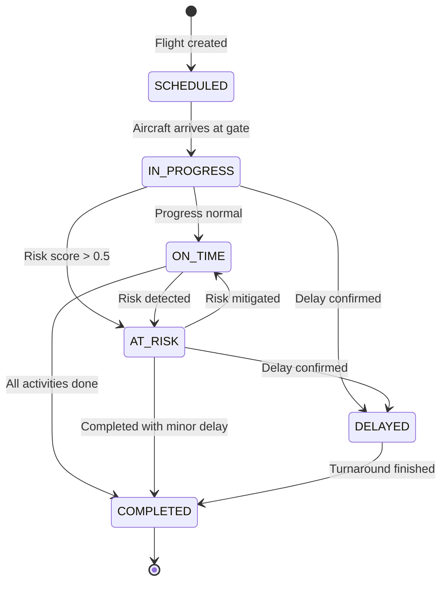
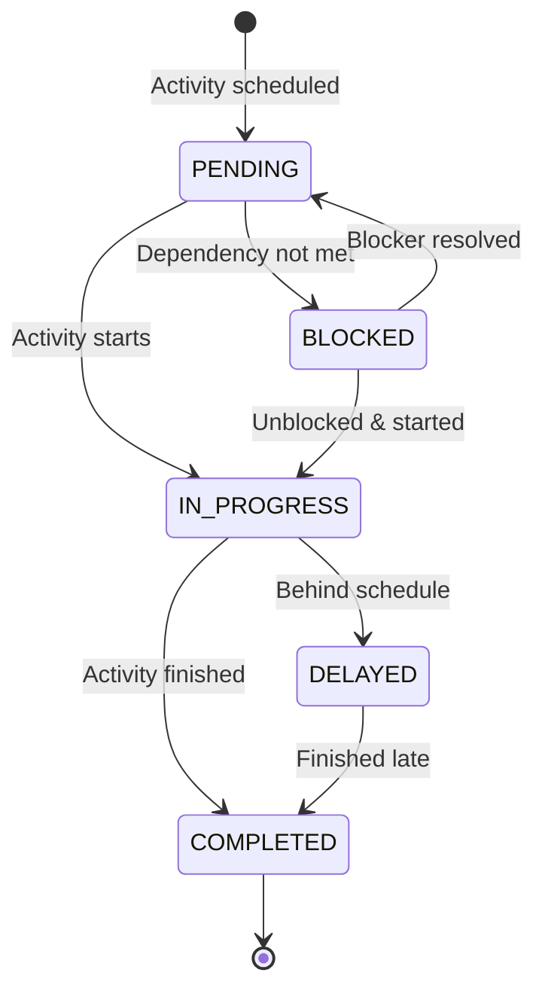
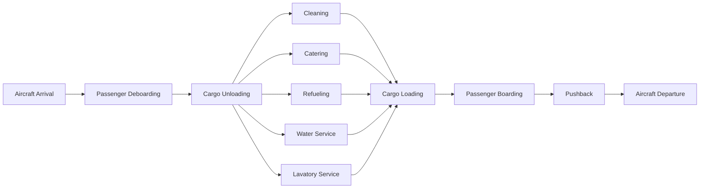
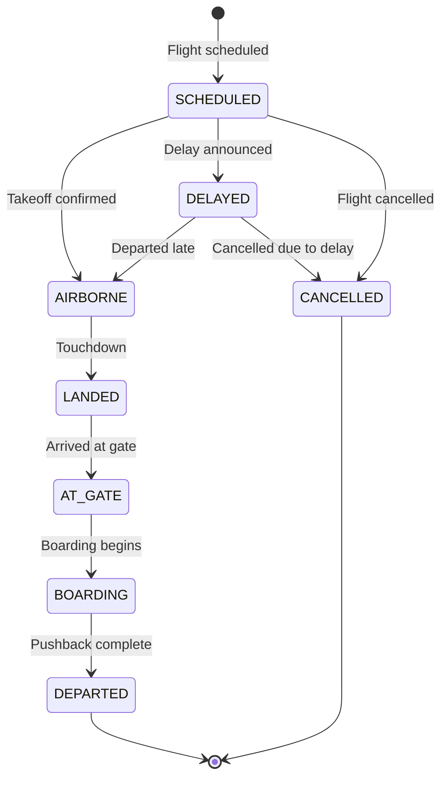
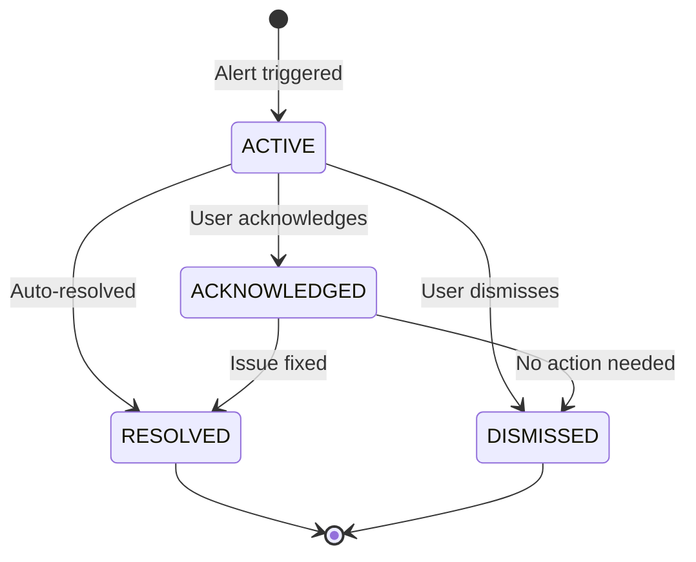
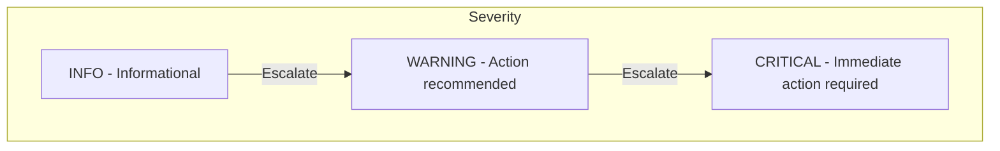
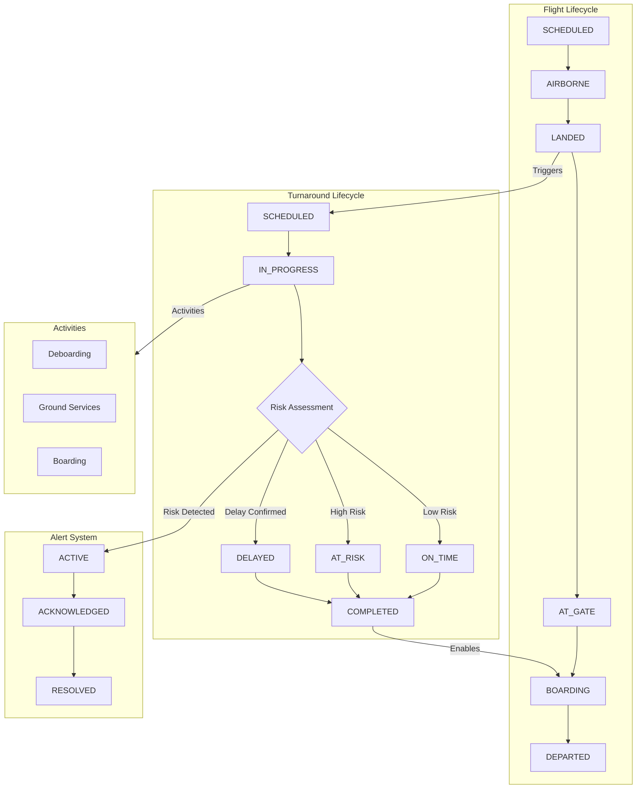

# State Machine Diagrams

This document defines the state machines used in the Ground Operations Intelligence Platform.

## Turnaround State Machine

The turnaround lifecycle from aircraft arrival to departure.

### Turnaround States

| State | Description |
|-------|-------------|
| `SCHEDULED` | Turnaround is planned but aircraft has not arrived |
| `IN_PROGRESS` | Aircraft at gate, ground operations underway |
| `ON_TIME` | Operations progressing within scheduled timeframe |
| `AT_RISK` | Potential delay detected (risk_score > 0.5) |
| `DELAYED` | Confirmed delay beyond scheduled completion |
| `COMPLETED` | All turnaround activities finished |

---

## Activity State Machine

Individual turnaround activities (cleaning, refueling, boarding, etc.)

### Activity States

| State | Description |
|-------|-------------|
| `PENDING` | Activity scheduled, waiting to start |
| `IN_PROGRESS` | Activity currently being performed |
| `COMPLETED` | Activity finished successfully |
| `DELAYED` | Activity running behind schedule |
| `BLOCKED` | Cannot start due to unmet dependencies |

### Activity Types (Sequential Order)

---

## Flight State Machine

Flight status progression through the system.

### Flight States

| State | Description |
|-------|-------------|
| `SCHEDULED` | Flight is planned |
| `AIRBORNE` | Aircraft is in flight |
| `LANDED` | Aircraft has touched down |
| `AT_GATE` | Aircraft parked at gate |
| `BOARDING` | Passengers boarding |
| `DEPARTED` | Aircraft has left |
| `DELAYED` | Flight is delayed |
| `CANCELLED` | Flight cancelled |

---

## Alert State Machine

Alert lifecycle from creation to resolution.

### Alert States

| State | Description |
|-------|-------------|
| `ACTIVE` | Alert is active and requires attention |
| `ACKNOWLEDGED` | User has seen and accepted the alert |
| `RESOLVED` | Issue has been addressed |
| `DISMISSED` | Alert was dismissed without action |

### Alert Severity Levels

---

## Combined System Flow

Overview of how states interact across the system.

---

## State Transition Rules

### Turnaround Transitions

| From | To | Trigger |
|------|-----|---------|
| SCHEDULED | IN_PROGRESS | `actual_start` is set |
| IN_PROGRESS | ON_TIME | `risk_score < 0.3` and on schedule |
| IN_PROGRESS | AT_RISK | `risk_score > 0.5` |
| IN_PROGRESS | DELAYED | `predicted_delay > threshold` |
| ON_TIME | AT_RISK | `risk_score` increases above 0.5 |
| AT_RISK | ON_TIME | Risk factors mitigated |
| AT_RISK | DELAYED | Delay becomes certain |
| * | COMPLETED | `actual_end` is set |

### Activity Transitions

| From | To | Trigger |
|------|-----|---------|
| PENDING | IN_PROGRESS | `actual_start` is set |
| PENDING | BLOCKED | Dependency activity not completed |
| BLOCKED | PENDING | Dependency resolved |
| IN_PROGRESS | COMPLETED | `actual_end` is set |
| IN_PROGRESS | DELAYED | `delay_minutes > 0` |
| DELAYED | COMPLETED | Activity finished despite delay |
